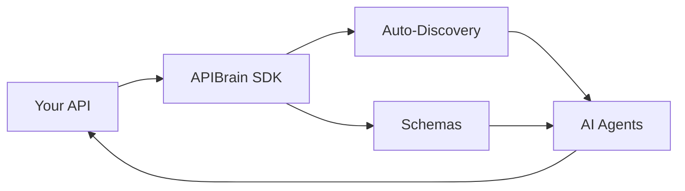

# **APIBrain SDK 🧠**

[](https://badge.fury.io/py/apibrain-sdk)
[](https://pypi.org/project/apibrain-sdk/)
[](https://opensource.org/licenses/MIT)

> Make any API self-descriptive and AI-agent-compatible in seconds.

The **APIBrain SDK** is a powerful tool that enables **FastAPI** applications to become **self-descriptive**, making it easier for AI agents to integrate and understand them. With just a few lines of code, your API becomes **discoverable and understandable** by autonomous systems.

## 💫 **Why APIBrain?**

- **90% Reduction in Integration Time**: AI agents automatically discover and understand your API.
- **Zero Manual Configuration**: Schemas and documentation are automatically generated.
- **Future-Ready**: Prepare your APIs for the era of autonomous agents.
- **Universal Compatibility**: Works with any existing **FastAPI** application.

---

## 🔄 **How It Works**



---

## ⚡ **Installation**

```bash
pip install apibrain-sdk
```

---

## 🚀 **Basic Example**

```python
from fastapi import FastAPI
from pydantic import BaseModel
from apibrain import APIBrain, capability

# Define models
class CalculationResponse(BaseModel):
    result: float
    operation: str

# API setup
app = FastAPI()
apibrain = APIBrain()

@capability(
    name="calculate",
    description="Performs mathematical operations",
    apibrain=apibrain
)
@app.post("/calculate")
async def calculate(a: float, b: float) -> CalculationResponse:
    return CalculationResponse(
        result=a + b,
        operation="sum"
    )

# Enable APIBrain
apibrain.enable(app)
```

---

## 🔥 **Advanced Example**

```python
from typing import Optional
from pydantic import BaseModel

class WeatherResponse(BaseModel):
    temperature: float
    condition: str
    humidity: Optional[float] = None

@capability(
    name="get_weather",
    description="Weather forecast by city",
    apibrain=apibrain
)
@app.get("/weather/{city}")
async def get_weather(
    city: str, 
    detailed: bool = False
) -> WeatherResponse:
    """
    Returns the weather forecast for a given city.
    - city: Name of the city
    - detailed: If True, includes humidity
    """
    return WeatherResponse(
        temperature=22.5,
        condition="Sunny",
        humidity=65.0 if detailed else None
    )
```

---

## 🎯 **Use Cases**

### 💰 **Finance**
- **Automated Trading**: API that enables AI agents to execute **buy/sell** operations based on real-time market analysis.

```python
@capability(
    name="execute_trade",
    description="Executes a trading operation",
    apibrain=apibrain
)
async def execute_trade(symbol: str, amount: float, operation: str):
    return {"status": "executed", "price": 100.50}
```

---

### 🆔 **Digital Identity**
- **Multimodal Verification**: System that combines **document verification, biometrics, and liveness detection**.

```python
@capability(
    name="verify_identity",
    description="Verifies identity using multiple factors",
    apibrain=apibrain
)
async def verify_identity(document: bytes, selfie: bytes, liveness: bytes):
    return {"verified": True, "score": 0.98}
```

---

### 🎨 **Multimodal AI**
- **Fully Interactive Virtual Assistant**: API that processes **text, images, and audio** to create interactive experiences.

```python
@capability(
    name="process_input",
    description="Processes multimodal input",
    apibrain=apibrain
)
async def process_input(text: str = None, image: bytes = None, audio: bytes = None):
    return {"response": "I understood your message!", "confidence": 0.95}
```

---

## 🌟 **Features**
- ✨ **Automatic endpoint discovery**
- 📝 **Automatic schema generation**
- 🚀 **FastAPI compatibility**
- 🔧 **Built-in Pydantic support**
- 📚 **OpenAPI-ready documentation**

---

## 🚀 **Getting Started**
1. **Install the SDK**
```bash
pip install apibrain-sdk
```

2. **Decorate your endpoints**
```python
@capability(name="endpoint", description="...")
```

3. **Enable APIBrain**
```python
apibrain.enable(app)
```

4. **Done!** Your API is now self-descriptive.

---

## 🤝 **Contributions**
Contributions are welcome! Please visit our [GitHub repository](https://github.com/system32miro/apibrain-sdk) to:
1. Report issues.
2. Suggest new features.
3. Submit pull requests.

---

## 📄 **License**
This project is licensed under the **MIT License** – see the [LICENSE](LICENSE) file for details.

---

## 🔗 **Useful Links**
- [Documentation](https://github.com/system32miro/apibrain-sdk/docs)
- [Examples](https://github.com/system32miro/apibrain-sdk/examples)
- [Changelog](https://github.com/system32miro/apibrain-sdk/CHANGELOG.md)
