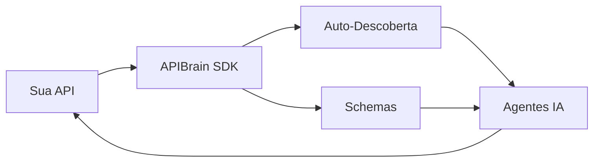

# APIBrain SDK 🧠

[](https://badge.fury.io/py/apibrain-sdk)
[](https://pypi.org/project/apibrain-sdk/)
[](https://opensource.org/licenses/MIT)

> Torne qualquer API auto-descritiva e compatível com agentes IA em segundos.

O APIBrain SDK é uma ferramenta poderosa que permite transformar APIs FastAPI em endpoints auto-descritivos, facilitando a integração com agentes de IA. Com apenas algumas linhas de código, sua API se torna descobrível e compreensível por sistemas autônomos.

## 💫 Por que APIBrain?

- **Redução de 90% no Tempo de Integração**: Agentes IA descobrem e compreendem sua API automaticamente
- **Zero Configuração Manual**: Schemas e documentação gerados automaticamente
- **Pronto para o Futuro**: Prepare suas APIs para a era dos agentes autônomos
- **Compatibilidade Universal**: Funciona com qualquer API FastAPI existente

## 🔄 Como Funciona



## ⚡ Instalação

```bash
pip install apibrain-sdk
```

## 🚀 Exemplo Básico

```python
from fastapi import FastAPI
from pydantic import BaseModel
from apibrain import APIBrain, capability

# Modelos
class CalculationResponse(BaseModel):
    result: float
    operation: str

# API
app = FastAPI()
apibrain = APIBrain()

@capability(
    name="calculate",
    description="Realiza operações matemáticas",
    apibrain=apibrain
)
@app.post("/calculate")
async def calculate(a: float, b: float) -> CalculationResponse:
    return CalculationResponse(
        result=a + b,
        operation="sum"
    )

# Habilita APIBrain
apibrain.enable(app)
```

## 🔥 Exemplo Avançado

```python
from typing import Optional
from pydantic import BaseModel

class WeatherResponse(BaseModel):
    temperature: float
    condition: str
    humidity: Optional[float] = None

@capability(
    name="get_weather",
    description="Previsão do tempo por cidade",
    apibrain=apibrain
)
@app.get("/weather/{city}")
async def get_weather(
    city: str, 
    detailed: bool = False
) -> WeatherResponse:
    """
    Retorna previsão do tempo para uma cidade.
    - city: Nome da cidade
    - detailed: Se True, inclui umidade
    """
    return WeatherResponse(
        temperature=22.5,
        condition="Ensolarado",
        humidity=65.0 if detailed else None
    )
```

## 🎯 Casos de Uso

### 💰 Finanças
- **Trading Automatizado**: API que permite agentes IA executarem operações de compra/venda baseadas em análise em tempo real
```python
@capability(
    name="execute_trade",
    description="Executa operação de trading",
    apibrain=apibrain
)
async def execute_trade(symbol: str, amount: float, operation: str):
    return {"status": "executed", "price": 100.50}
```

### 🆔 Identidade Digital
- **Verificação Multimodal**: Sistema que combina verificação de documentos, biometria e prova de vida
```python
@capability(
    name="verify_identity",
    description="Verifica identidade usando múltiplos fatores",
    apibrain=apibrain
)
async def verify_identity(document: bytes, selfie: bytes, liveness: bytes):
    return {"verified": True, "score": 0.98}
```

### 🎨 Multimodalidade
- **Assistente Virtual Completo**: API que processa texto, imagem e áudio para criar experiências interativas
```python
@capability(
    name="process_input",
    description="Processa entrada multimodal",
    apibrain=apibrain
)
async def process_input(text: str = None, image: bytes = None, audio: bytes = None):
    return {"response": "Entendi sua mensagem!", "confidence": 0.95}
```

## 🌟 Recursos

- ✨ Auto-descoberta de endpoints
- 📝 Schemas automáticos
- 🚀 Compatível com FastAPI
- 🔧 Suporte a Pydantic
- 📚 Documentação OpenAPI

## 🚀 Começando

1. **Instale o SDK**
```bash
pip install apibrain-sdk
```

2. **Decore seus endpoints**
```python
@capability(name="endpoint", description="...")
```

3. **Habilite o APIBrain**
```python
apibrain.enable(app)
```

4. **Pronto!** Sua API agora é auto-descritiva

## 🤝 Contribuição

Contribuições são bem-vindas! Por favor, visite nosso [repositório no GitHub](https://github.com/system32miro/apibrain-sdk) para:

1. Reportar bugs
2. Sugerir novas features
3. Enviar pull requests

## 📄 Licença

Este projeto está licenciado sob a licença MIT - veja o arquivo [LICENSE](LICENSE) para detalhes.

## 🔗 Links Úteis

- [Documentação](https://github.com/system32miro/apibrain-sdk/docs)
- [Exemplos](https://github.com/system32miro/apibrain-sdk/examples)
- [Changelog](https://github.com/system32miro/apibrain-sdk/CHANGELOG.md)

---
Desenvolvido com ❤️ pela APIBrain Team 